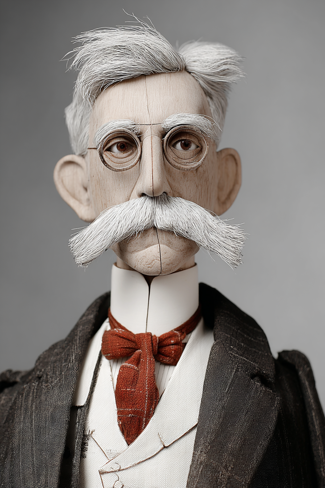
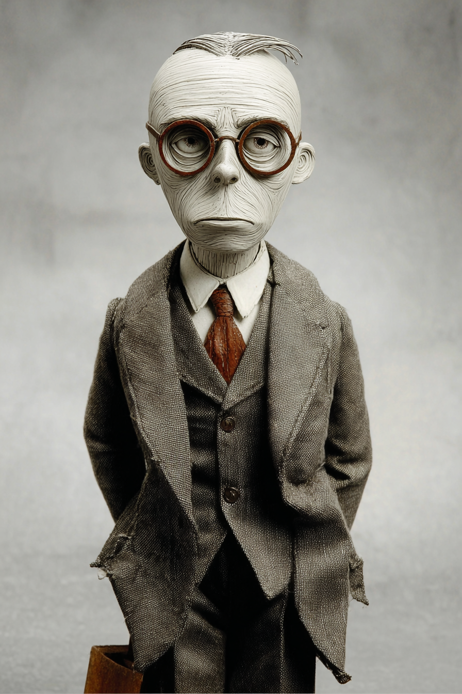

# Business Law — Wayback Sections

> Extracted from `chapters/`. Each entry corresponds to one chapter file.
> Sections are instructor-authored. Missing sections show a placeholder only.
> Do not edit this file directly — edit the source chapter file, then re-run extraction.

---

## Chapter 00: Business Law: with LLMs
*Source: `chapters/00-frontmatter.md`*

> **Section not yet authored.** No `## AI Wayback Machine` block found in this chapter file.
> To add this section, edit the source chapter file directly.

---

## Chapter 00: Introduction
*Source: `chapters/00-introduction.md`*

> **Section not yet authored.** No `## AI Wayback Machine` block found in this chapter file.
> To add this section, edit the source chapter file directly.

---

## Chapter 01: Chapter 1 — American Law, Legal Reasoning, and the Legal System
*Source: `chapters/01-american-law-legal-reasoning-and-the-legal-system.md`*

## AI Wayback Machine

The ideas in this chapter didn't appear from nowhere. **Oliver Wendell Holmes Jr.** wrote *The Common Law* in 1881 — opening with "the life of the law has not been logic; it has been experience." His pragmatic theory of legal reasoning shaped every major American law-school course of the 20th century.



*Puppet Art by [Nik Bear Brown](https://www.nikbearbrown.com/).*

**Run this:**

```
Who was Oliver Wendell Holmes Jr., and how does his legal pragmatism connect to American legal reasoning as we covered in this chapter? Keep it to three paragraphs. End with the single most surprising thing about his career or ideas.
```

→ Search **"Oliver Wendell Holmes Jr."** on Wikipedia.

**Now make the prompt better.** Try one of these:

- Ask it to apply Holmes's "bad man" theory of law to one specific business-law case — what does it predict the bad man wants to know?
- Ask it to confront Holmes's dark side — his vote in *Buck v. Bell* upholding forced sterilization — and how it sits with his celebrated reputation.

What changes? What gets better? What gets worse?

---

## Chapter 02: Chapter 2 — Disputes and Dispute Settlement
*Source: `chapters/02-disputes-and-dispute-settlement.md`*

## AI Wayback Machine

The ideas in this chapter didn't appear from nowhere. **Frank Sander** delivered the 1976 Pound Conference speech proposing the "multi-door courthouse" — different doors for litigation, mediation, arbitration, and other dispute resolution methods. Modern alternative dispute resolution (ADR) is essentially his framework, scaled up.


*Puppet Art by [Nik Bear Brown](https://www.nikbearbrown.com/).*

**Run this:**

```
Who was Frank Sander, and how does his "multi-door courthouse" idea connect to the dispute-settlement systems we covered in this chapter? Keep it to three paragraphs. End with the single most surprising thing about his career or ideas.
```

→ Search **"Frank Sander"** on Wikipedia.

**Now make the prompt better.** Try one of these:

- Ask it to map a specific dispute (employment, contract breach, product liability) onto the appropriate "door" in Sander's framework.
- Ask it to compare Sander's vision with how ADR actually evolved in the US since 1976.

What changes? What gets better? What gets worse?

---

## Chapter 03: Chapter 3 — Business Ethics and Social Responsibility
*Source: `chapters/03-business-ethics-and-social-responsibility.md`*

## AI Wayback Machine

The ideas in this chapter didn't appear from nowhere. **Archie Carroll** published the "pyramid of corporate social responsibility" in 1991 — economic, legal, ethical, and philanthropic responsibilities stacked in a hierarchy. The pyramid is still the most-taught framework for CSR three decades on.

**Run this:**

```
Who is Archie Carroll, and how does his CSR pyramid connect to the business ethics and social responsibility framework we covered in this chapter? Keep it to three paragraphs. End with the single most surprising thing about his career or ideas.
```

→ Search **"Archie B. Carroll"** on Wikipedia.

**Now make the prompt better.** Try one of these:

- Ask it to apply Carroll's pyramid to one current corporate scandal — which level did the company fail at?
- Ask it to compare Carroll's pyramid with the newer "shared value" framework from Porter and Kramer.

What changes? What gets better? What gets worse?

---

## Chapter 04: Chapter 4 — Business and the United States Constitution
*Source: `chapters/04-business-and-the-united-states-constitution.md`*

## AI Wayback Machine

The ideas in this chapter didn't appear from nowhere. **Felix Frankfurter** spent decades on the Supreme Court shaping the Commerce Clause and economic regulation — and earlier, as a Harvard Law professor and FDR adviser, he helped draft the labor and securities laws that constitute the modern business-Constitution framework.

**Run this:**

```
Who was Felix Frankfurter, and how does his commerce-clause jurisprudence connect to the relationship between business and the US Constitution we covered in this chapter? Keep it to three paragraphs. End with the single most surprising thing about his career or ideas.
```

→ Search **"Felix Frankfurter"** on Wikipedia.

**Now make the prompt better.** Try one of these:

- Ask it to walk through one Frankfurter Commerce Clause opinion that's still cited in business-regulation cases today.
- Ask it about the Frankfurter–Black judicial-philosophy split — what stakes for business law sat on each side?

What changes? What gets better? What gets worse?

---

## Chapter 05: Chapter 5 — Criminal Liability
*Source: `chapters/05-criminal-liability.md`*

## AI Wayback Machine

The ideas in this chapter didn't appear from nowhere. **Edwin Sutherland** coined the term "white-collar crime" in his 1939 American Sociological Association presidential address — challenging the assumption that crime was a working-class problem. He spent the rest of his career documenting corporate criminality.



*Puppet Art by [Nik Bear Brown](https://www.nikbearbrown.com/).*

**Run this:**

```
Who was Edwin Sutherland, and how does his concept of "white-collar crime" connect to the corporate criminal liability we covered in this chapter? Keep it to three paragraphs. End with the single most surprising thing about his career or ideas.
```

→ Search **"Edwin Sutherland"** on Wikipedia.

**Now make the prompt better.** Try one of these:

- Ask it to apply Sutherland's framework to one specific recent corporate prosecution (Enron, Volkswagen, Theranos).
- Ask it about Sutherland's differential association theory — and how it explains corporate crime as learned, not pathological.

What changes? What gets better? What gets worse?

---

## Chapter 06: Chapter 6 — The Tort System
*Source: `chapters/06-the-tort-system.md`*

## AI Wayback Machine

The ideas in this chapter didn't appear from nowhere. **Guido Calabresi** wrote *The Cost of Accidents* in 1970 — laying the foundation for the law-and-economics approach to tort law. His later judicial career on the Second Circuit applied the framework to real cases.

**Run this:**

```
Who is Guido Calabresi, and how does his law-and-economics analysis of accident law connect to the tort system we covered in this chapter? Keep it to three paragraphs. End with the single most surprising thing about his career or ideas.
```

→ Search **"Guido Calabresi"** on Wikipedia.

**Now make the prompt better.** Try one of these:

- Ask it to walk through Calabresi's "cheapest cost avoider" rule on one specific product-liability scenario.
- Ask it to compare Calabresi's economic view of tort law with the "corrective justice" view of Ernest Weinrib.

What changes? What gets better? What gets worse?

---

## Chapter 07: Chapter 7 — Contract Law
*Source: `chapters/07-contract-law.md`*

## AI Wayback Machine

The ideas in this chapter didn't appear from nowhere. **Karl Llewellyn** led the drafting of the Uniform Commercial Code in the 1940s and 50s — modernizing U.S. commercial law into a single framework adopted (with variations) by every state. The contract sections you study today are largely his.

**Run this:**

```
Who was Karl Llewellyn, and how does his work drafting the Uniform Commercial Code connect to the contract law we covered in this chapter? Keep it to three paragraphs. End with the single most surprising thing about his career or ideas.
```

→ Search **"Karl Llewellyn"** on Wikipedia.

**Now make the prompt better.** Try one of these:

- Ask it to apply Llewellyn's "realist" approach to one specific contract dispute — what would he look at that a formalist wouldn't?
- Ask it about Llewellyn's earlier work on Cheyenne tribal law — and how it shaped his views on legal systems.

What changes? What gets better? What gets worse?

---

## Chapter 08: Chapter 8 — Warranties and Sales Contracts
*Source: `chapters/08-sales-contracts.md`*

> **Section not yet authored.** No `## AI Wayback Machine` block found in this chapter file.
> To add this section, edit the source chapter file directly.

---

## Chapter 09: Chapter 9 — Employment and Labor Law
*Source: `chapters/09-employment-and-labor-law.md`*

## AI Wayback Machine

The ideas in this chapter didn't appear from nowhere. **Frances Perkins** drafted the Social Security Act, the Fair Labor Standards Act (40-hour week, minimum wage), and the architecture of U.S. unemployment insurance — as FDR's Labor Secretary and the first woman to serve in a U.S. cabinet. Modern employment law is built on her foundation.


*Puppet Art by [Nik Bear Brown](https://www.nikbearbrown.com/).*

**Run this:**

```
Who was Frances Perkins, and how does her work designing US labor and employment law connect to the framework we covered in this chapter? Keep it to three paragraphs. End with the single most surprising thing about her career or ideas.
```

→ Search **"Frances Perkins"** on Wikipedia.

**Now make the prompt better.** Try one of these:

- Ask it to trace one specific FLSA provision (overtime pay, child labor protection) from Perkins's 1938 design to today.
- Ask it about Perkins's role in the witnesses-to-the-Triangle-Shirtwaist-Fire generation and how 1911 shaped her policy career.

What changes? What gets better? What gets worse?

---

## Chapter 10: Chapter 10 — Government Regulation
*Source: `chapters/10-government-regulation.md`*

## AI Wayback Machine

The ideas in this chapter didn't appear from nowhere. **James Landis** designed the modern administrative state in the 1930s — drafting the Securities Act of 1933 and chairing the SEC. His 1938 book *The Administrative Process* defended expert agencies as the answer to industrial-era regulation.

**Run this:**

```
Who was James Landis, and how does his work designing the administrative state connect to the government regulation we covered in this chapter? Keep it to three paragraphs. End with the single most surprising thing about his career or ideas.
```

→ Search **"James M. Landis"** on Wikipedia.

**Now make the prompt better.** Try one of these:

- Ask it to walk through Landis's defense of the SEC's structure — expert commissioners with rulemaking, enforcement, and adjudicative powers.
- Ask it about Landis's later disgrace and conviction for tax evasion — and how the personal tragedy fits with the institutional architecture he built.

What changes? What gets better? What gets worse?

---

## Chapter 11: Chapter 11 — Antitrust Law
*Source: `chapters/11-antitrust-law.md`*

## AI Wayback Machine

The ideas in this chapter didn't appear from nowhere. **Lina Khan** wrote "Amazon's Antitrust Paradox" as a Yale Law student in 2017 — arguing that the consumer-welfare framework that has dominated antitrust since the 1970s misses platform monopoly power entirely. She became FTC Chair at 32 and tried to put the argument into practice.

**Run this:**

```
Who is Lina Khan, and how does her antitrust framework connect to the antitrust law we covered in this chapter? Keep it to three paragraphs. End with the single most surprising thing about her career or ideas.
```

→ Search **"Lina Khan"** on Wikipedia.

**Now make the prompt better.** Try one of these:

- Ask it to walk through the core argument of "Amazon's Antitrust Paradox" — what specifically does the consumer-welfare standard miss?
- Ask it to compare Khan's revival of structural antitrust with Robert Bork's consumer-welfare position that dominated for forty years.

What changes? What gets better? What gets worse?

---

## Chapter 12: Chapter 12 — Unfair Trade Practices and the Federal Trade Commission
*Source: `chapters/12-unfair-trade-practices-and-the-federal-trade-commission.md`*

## AI Wayback Machine

The ideas in this chapter didn't appear from nowhere. **Louis Brandeis** argued the case for the original FTC in 1914 — and as a Supreme Court Justice, championed the regulation of "the curse of bigness." His framework that economic concentration is itself a political problem still shapes modern unfair-trade-practices law.

**Run this:**

```
Who was Louis Brandeis, and how does his work on antitrust and unfair trade practices connect to the FTC framework we covered in this chapter? Keep it to three paragraphs. End with the single most surprising thing about his career or ideas.
```

→ Search **"Louis Brandeis"** on Wikipedia.

**Now make the prompt better.** Try one of these:

- Ask it to apply Brandeis's "curse of bigness" framing to one current corporate concentration debate — what does it suggest?
- Ask it about the contested confirmation of Brandeis as the first Jewish Supreme Court Justice in 1916.

What changes? What gets better? What gets worse?

---

## Chapter 13: Chapter 13 — International Law
*Source: `chapters/13-international-law.md`*

## AI Wayback Machine

The ideas in this chapter didn't appear from nowhere. **Hersch Lauterpacht** drafted the language of "crimes against humanity" used at Nuremberg and helped build the modern international human-rights legal framework. He was a Polish-Jewish scholar who lost most of his family in the Holocaust.

**Run this:**

```
Who was Hersch Lauterpacht, and how does his work on international human rights law connect to the international law we covered in this chapter? Keep it to three paragraphs. End with the single most surprising thing about his career or ideas.
```

→ Search **"Hersch Lauterpacht"** on Wikipedia.

**Now make the prompt better.** Try one of these:

- Ask it to walk through Lauterpacht's individual-rights framing and contrast it with Raphael Lemkin's group-protection framing of "genocide."
- Ask it about Lauterpacht's prewar work at the LSE on international law and the rise of human-rights doctrine.

What changes? What gets better? What gets worse?

---

## Chapter 14: Chapter 14 — Securities Regulation
*Source: `chapters/14-securities-regulation.md`*

## AI Wayback Machine

The ideas in this chapter didn't appear from nowhere. **Mary Schapiro** chaired the SEC during the 2008 financial crisis — and earlier ran FINRA and the CFTC, making her the first person to head every major U.S. financial regulator. The post-Dodd-Frank securities framework you have studied was implemented under her watch.

**Run this:**

```
Who is Mary Schapiro, and how does her work as SEC chair during the financial crisis connect to the securities regulation we covered in this chapter? Keep it to three paragraphs. End with the single most surprising thing about her career or ideas.
```

→ Search **"Mary Schapiro"** on Wikipedia.

**Now make the prompt better.** Try one of these:

- Ask it to walk through one specific Dodd-Frank rule the SEC implemented under Schapiro and trace it from statute to final rule.
- Ask it about the SEC's pre-2008 regulatory failures — and what Schapiro identified as the institutional causes.

What changes? What gets better? What gets worse?

---

## Chapter 99: 99 Back Matter
*Source: `chapters/99-back-matter.md`*

> **Section not yet authored.** No `## AI Wayback Machine` block found in this chapter file.
> To add this section, edit the source chapter file directly.

---
